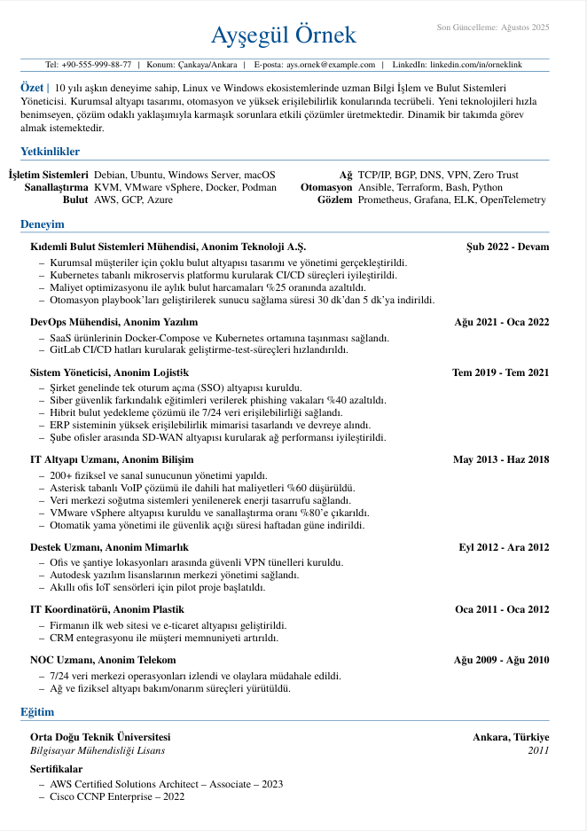

## ATS uyumlu LaTeX Özgeçmiş Örneği

### Açıklama
Hem ATS'ler tarafından hem de insanlar tarafından kolay okunabilir, sayfanın her alanını kullanan bir özgeçmiş şablonu.

Kullanmak için LaTeX bilmenize gerek yok, sadece [overleaf.com](https://www.overleaf.com) sitesinde hesap açıp [bu](Aysegul_Ornek_Ozgecmis.tex) dosyanın içeriğini tamamen kopyalayın.

### Değişiklikler

- ATS yazılımlarının okuyabileceği şekilde Türkçe karakterleri destekleyen Times New Roman eşleniği **TeX Gyre Termes** kullanıldı  
- Sayfa **A4** ve yazılar **11 punto** olacak şekilde değiştirildi  
- ATS yazılımlarında sorun oluşturmaması açısından **fontawesome ikonları** ve **en-dash'ler** çıkarıldı  
- **Son güncelleme** kısmı eklendi (istemiyorsanız satırı tamamen silebilirsiniz)  
- Yaptığım testlerde PDF çıktısındaki Türkçe karakterler pdf veri çıkarma araçları tarafından okunuyor.

---
## Örnek Görsel ve PDF çıktısı

**Author**: Muzaffer Seha Çuhadar  
**Based on the work of**: Michael Lustfield  
**License**: [CC-BY-4](https://creativecommons.org/licenses/by/4.0/legalcode.txt)